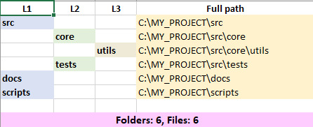
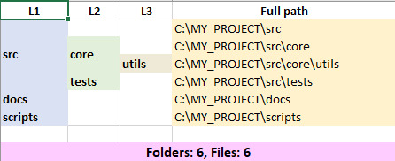
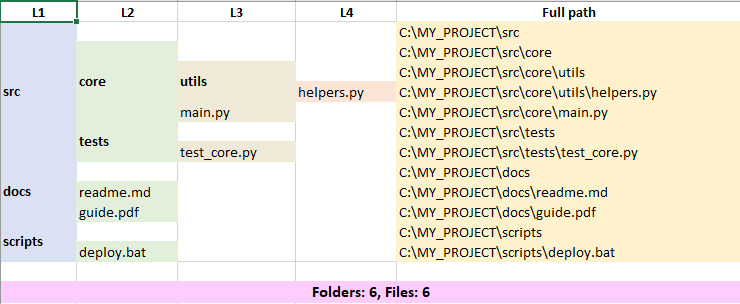
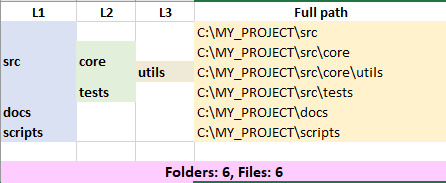

<a id="readme-top"></a>


# Tree to Excel Parser

**Краткое описание:**

Преобразует текстовый вывод команды `tree` (стандартный или с ключом `/A`) в структурированную Excel-таблицу, автоматически определяя кодировку входного файла и [корректно](#6-особенности-парсинга-и-ограничения) распознавая папки и файлы даже для сложных случаев (пустые папки, файлы без расширения, папки с точкой в имени).
Программа поддерживает три режима отображения – плоский (`flat`), объединённый (`merged`) и полный (`merged_full`) с цветовой кодировкой уровней и жирным шрифтом для папок.
Полезно для визуализации иерархии каталогов, сохранения и/или аудита файловой структуры, документирования проектов, подготовки отчётов по вложенности, а также для последующего анализа данных в Excel без необходимости ручного копирования и форматирования.

>**ВАЖНО:** Программа в первую очередь писалась для кириллицы, поэтому точно определяет кириллические шрифты в кодировках UTF-8 и CP866. Для других кодировок результат не гарантируется.

<!-- ОГЛАВЛЕНИЕ -->

<details>
  <summary>Оглавление</summary>
  <ol>
    <li>
      <a href="#1-возможности">Возможности</a>
    </li>
    <li>
      <a href="#2-установка">Установка</a>
      <ul>
        <li><a href="#требования">Требования</a></li>
        <li><a href="#шаги">Шаги</a></li>
      </ul>
    </li>
    <li>
      <a href="#3-использование">Использование</a>
      <ul>
        <li><a href="#синтаксис">Синтаксис</a></li>
        <li><a href="#параметры">Параметры</a></li>
        <li><a href="#примеры">Примеры</a></li>
        <li><a href="#примечания">Примечания</a></li>
      </ul>
    </li>
    <li>
      <a href="#4-режимы-вывода">Режимы вывода</a>
      <ul>
        <li><a href="#41-режим-flat-плоский">Режим `flat` (плоский)</a></li>
        <li><a href="#42-режим-merged-объединённый">Режим `merged` (объединённый)</a></li>
        <li><a href="#43-режим-merged_full-полный-объединённый">Режим `merged_full` (полный объединённый)</a></li>
      </ul>
    </li>
    <li>
      <a href="#5-пример-работы">Пример работы</a>
      <ul>
        <li><a href="#51-входной-файл-без-ключа-a">Входной файл (без ключа `/A`)</a></li>
        <li><a href="#52-входной-файл-c-ключом-a">Входной файл (с ключом `/A`)</a></li>
      </ul>
    </li>
    <li>
      <a href="#6-особенности-парсинга-и-ограничения">Особенности парсинга и ограничения</a>
      <ul>
        <li><a href="#61-стандартный-формат-tree-без-ключа-a">Стандартный формат `tree` (без ключа `/A`)</a></li>
        <li><a href="#62-формат-tree-a-ascii">Формат `tree /A` (ASCII)</a></li>
        <li><a href="#63-рекомендации-по-обходу-ограничений">Рекомендации по обходу ограничений</a></li>
        <li><a href="#64-кодировки">Кодировки</a></li>
        <li><a href="#65-общее-замечание">Общее замечание</a></li>
      </ul>
    </li>
    <li>
      <a href="#7-тестирование">Тестирование</a>
      <ul>
        <li><a href="#запуск-тестов">Запуск тестов</a></li>
      </ul>
    </li>
    <li><a href="#8-лицензия">Лицензия</a></li>
    <li><a href="#9-вклад-в-проект">Вклад в проект</a></li>
  </ol>
</details>

<!-- ВОЗМОЖНОСТИ -->
## 1. Возможности

- **Поддержка двух форматов `tree`**
Работает как с выводом стандартной команды `tree` (с символами `├───`, `└───`), так и с ASCII-форматом (`tree /A`), где используются `+---`, `\---`.

- **Три режима представления данных**
  - `flat` – только папки, каждая в отдельной строке;
  - `merged` – только папки с объединением ячеек для повторяющихся имён предков (удобно для визуализации иерархии);
  - `merged_full` – все элементы (папки и файлы), объединение ячеек.

Уровни вложенности отображаются в соответствующих столбцах. Папки выделены **жирным** шрифтом.

- **Автоматическое определение кодировки**
Входной файл анализируется с помощью библиотеки `chardet`. Если уверенность определения ниже 0.85, программа переключается на **UTF-8** и выводит предупреждение, советуя при необходимости указать кодировку явно через параметр `--encoding`. Это гарантирует, что даже при сомнительном определении данные не будут потеряны, а пользователь сможет легко исправить ситуацию.

- **Цветовое выделение уровней**
Каждый уровень вложенности в Excel получает свой цвет фона. Путь к элементу окрашивается в жёлтый цвет.

- **Статистика в конце таблицы**
Автоматически добавляется строка с общим количеством папок и файлов.

- **Гибкий вывод**
Если выходной файл не указан, имя генерируется автоматически на основе имени входного файла и выбранного режима.

- **Простота использования**
Инструмент предназначен для работы из командной строки и не требует графического интерфейса.

<p align="right"><a href="#readme-top">в начало</a></p>

---

<!-- УСТАНОВКА -->
## 2. Установка

Простейший способ установки из PyPI:

```bash
pip install tree-to-excel
```

### Требования

- Python версии **3.8** или выше.
- Установленный пакетный менеджер `pip`.

### Шаги

1. Клонируйте репозиторий или скачайте файлы проекта.
2. Перейдите в корневую папку проекта (где находится `requirements.txt`).
3. Установите необходимые зависимости:

   ```bash
   pip install -r requirements.txt
   ```

4. Для запуска тестов также потребуется `pytest` – он уже включён в `requirements.txt`, но если вы не планируете тестировать, его можно не устанавливать (он не используется в основном скрипте).

После установки зависимостей программа `tree_to_excel.py` готов к использованию.

<p align="right"><a href="#readme-top">в начало</a></p>

---

<!-- ИСПОЛЬЗОВАНИЕ -->
## 3. Использование

### Синтаксис

```bash
python src/tree_to_excel/tree_to_excel.py -i <входной_файл> [-m <режим>] [-o <выходной_файл>] [-e <кодировка>]
```

> После установки скрипт доступен в виде команды tree-to-excel.

### Параметры

| Параметр         | Описание                                                                                                                                                                                      |
|------------------|-----------------------------------------------------------------------------------------------------------------------------------------------------------------------------------------------|
| `-i, --input`    | **Обязательный.** Путь к текстовому файлу с выводом команды `tree`.                                                                                                                           |
| `-m, --mode`     | Режим формирования таблицы. Допустимые значения: `flat`, `merged`, `merged_full`. По умолчанию: `flat`.                                                                                       |
| `-o, --output`   | Путь для сохранения Excel-файла. Если не указан, имя генерируется автоматически: `<имя_входного_файла>_<режим>.xlsx` в той же папке, что и входной файл.                                      |
| `-e, --encoding` | Принудительно задать кодировку входного файла (например, UTF-8, cp1251). Переопределяет автоматическое определение. Полезно, если автоопределение даёт сбой (например, для редких кодировок). |
| `--version`      | Показать версию программы и выйти.                                                                                                                                                            |

### Примеры

1. **Базовый запуск** (режим `flat`, выходной файл создаётся автоматически):

   ```bash
   python src/tree_to_excel/tree_to_excel.py -i tree_output.txt
   ```

2. **Указание режима и выходного файла**:

   ```bash
   python src/tree_to_excel/tree_to_excel.py -i tree.txt -m merged_full -o result.xlsx
   ```

3. **Указание кодировки**

   ```bash
   python src/tree_to_excel/tree_to_excel.py -i tree.txt -m merged_full -e CP866
   ```

4. **Получение справки**:

   ```bash
   python src/tree_to_excel/tree_to_excel.py -h
   ```

### Примечания

- Входной файл должен содержать вывод команды `tree` в одном из поддерживаемых форматов (стандартном или с ключом `/A`). Примеры таких файлов можно найти в папке `examples/`.
- Если входной файл не содержит корректного корневого пути (в формате `X:\...`), программа завершится с ошибкой.
- При успешном выполнении в консоль выводится путь к созданному Excel-файлу.
- В случае ошибок (отсутствие файла, проблемы с парсингом) сообщения выводятся в `stderr`.

<p align="right"><a href="#readme-top">в начало</a></p>

---

<!-- РЕЖИМ ВЫВОДА -->
## 4. Режимы вывода

Программа поддерживает три режима, которые определяют, какие элементы попадают в Excel и как они группируются. Выбор режима зависит от ваших задач: хотите ли вы видеть только папки или все элементы, и нужна ли вам визуальная иерархия с объединением ячеек.

### 4.1. Режим `flat` (плоский)

- **Что попадает в таблицу:** только папки (файлы исключаются).
- **Как выглядит:** каждый элемент (папка) занимает отдельную строку. Имя папки помещается в столбец, соответствующий её уровню вложенности (L1, L2, …). Таким образом, уровень виден по положению имени в строке.
- **Особенности:** ячейки не объединяются, структура читается по столбцам. Это удобно для дальнейшей фильтрации или сортировки в Excel.

**Пример команды:**

```bash
python src/tree_to_excel/tree_to_excel.py tree.txt -m flat
```

### 4.2. Режим `merged` (объединённый)

- **Что попадает в таблицу:** только папки.
- **Как выглядит:** для каждого уровня столбцы заполняются именами папок-предков. Если имя предка повторяется для нескольких дочерних элементов, ячейки с этим именем объединяются по вертикали. Это создаёт визуальное дерево, похожее на структуру папок в проводнике.
- **Особенности:** объединение выполняется только для папок, файлы игнорируются. В результате получается компактное представление иерархии.

**Пример команды:**

```bash
python src/tree_to_excel/tree_to_excel.py -i tree.txt -m merged
```

### 4.3. Режим `merged_full` (полный объединённый)

- в таблицу попадают все элементы – и папки, и файлы.
- визуально результат аналогичен режиму `merged`, но теперь файлы также включаются в строки. Папки в таблице выделяются **жирным шрифтом**, файлы – обычным. Это позволяет сразу отличить каталоги от файлов.
- объединение ячеек работает для всех повторяющихся имён предков.

**Пример команды:**

```bash
python src/tree_to_excel/tree_to_excel.py -i tree.txt -m merged_full
```

<br>

|     Режим     |       Папки        |       Файлы        | Объединение ячеек  |
|:-------------:|:------------------:|:------------------:|:------------------:|
|    `flat`     | :white_check_mark: |        :x:         |        :x:         |
|   `merged`    | :white_check_mark: |        :x:         | :white_check_mark: |
| `merged_full` | :white_check_mark: | :white_check_mark: | :white_check_mark: |

<p align="right"><a href="#readme-top">в начало</a></p>

---

<!-- ПРИМЕР РАБОТЫ -->
## 5. Пример работы

### 5.1. Входной файл (без ключа `/A`)

Пример текстового файла `project_tree.txt` со следующим содержимым (вывод команды `tree` без ключа `/A`):

```text
Folder PATH listing for volume System
Volume serial number is 00000001 1234:5678
C:\MY_PROJECT
├───src
│   ├───core
│   │   ├───utils
│   │   │   └───helpers.py
│   │   └───main.py
│   └───tests
│       └───test_core.py
├───docs
│   ├───readme.md
│   └───guide.pdf
└───scripts
    └───deploy.bat
```

После выполнения создается файл `project_tree_[режим].xlsx`:

- пример вывода в режиме `flat`:

<div align="center">



</div>

- пример вывода в режиме `merged`:

<div align="center">



</div>

- пример вывода в режиме `merged_full`:

<div align="center">



</div>

### 5.2. Входной файл (c ключом `/A`)

Пример текстового файла `project_tree.txt` со следующим содержимым (вывод команды `tree` c ключом `/A`):

```text
Folder PATH listing for volume System
Volume serial number is 00000001 1234:5678
C:\MY_PROJECT
+---src
│   +---core
│   │   +---utils
│   │   │   \---helpers.py
│   │   \---main.py
│   \---tests
│       \---test_core.py
+---docs
│   +---readme.md
│   \---guide.pdf
\---scripts
    \---deploy.bat
```

После выполнения создается файл `project_tree_[режим].xlsx`:

- пример вывода в режиме `flat`:

<div align="center">


</div>

- пример вывода в режиме `merged`:

<div align="center">



</div>

- пример вывода в режиме `merged_full`:

<div align="center">


</div>

<p align="right"><a href="#readme-top">в начало</a></p>

---

<!-- ОСОБЕННОСТИ И ОГРАНИЧЕНИЯ -->
## 6. Особенности парсинга и ограничения

При преобразовании дерева в Excel необходимо учитывать особенности парсинга, связанные с тем, как программа отличает папки от файлов.

### 6.1. Стандартный формат `tree` (без ключа `/A`)

Парсер определяет тип элемента (папка или файл) следующим способом:

1. **Если у элемента есть потомки** – это **папка**.
2. **Если потомков нет, но присутствует маркер** (`+---`, `\---`, `├───`, `└───`):
   - **и в имени есть точка (`.`)**: элемент считается **файлом**.
   - **и в имени нет точки**: элемент считается **пустой папкой**.

Эта логика может давать сбои в следующих случаях:

- **Папки с точкой в имени**  
  Например, `project.v1`, `.config`, `my.folder`.  
  Поскольку в имени есть точка, парсер сочтёт их файлами, даже если это пустые папки (или папки, у которых нет видимых потомков в выводе `tree`).
  *Результат:* такие папки не попадут в режимы `flat` и `merged` (там выводятся только папки) и будут отображаться как файлы в `merged_full`.

- **Файлы без расширения**  
  Например, `README`, `Makefile`, `LICENSE`, `Dockerfile`.
  *Результат:* они будут ошибочно включены в списки папок в режимах `flat` и `merged`, а в `merged_full` будут выделены жирным шрифтом как папки.

### 6.2. Формат `tree /A` (ASCII)

В этом формате все маркеры используют только символы `+`, `\`, `|` и пробелы. Парсер **не использует маркер** для определения типа элемента – папкой считается только тот элемент, у которого есть потомки.

**Пустые папки не распознаются** и всегда определяются как файлы. Команда `tree /A` в Windows не выводит пустые папки с маркерами ветвления так же явно, как стандартный вывод, или выводит их без индикаторов продолжения, из-за чего парсер не может отличить их от файлов без расширения.

### 6.3. Рекомендации по обходу ограничений

Если ваша структура содержит **папки с точками** или **файлы без расширений**, и вы хотите избежать ошибочной классификации, используйте один из двух методов:

- используйте вывод `tree /A` (ASCII) для таких структур – тогда папки с точками будут корректно определены (при условии, что у них есть потомки). Однако **пустые папки** в этом случае будут ошибочно определены как файлы (и, следовательно, не попадут в режимы `flat` и `merged`).
- сохраните стандартный вывод `tree` и **вручную проверьте** полученный Excel-файл, при необходимости скорректировав типы элементов (это можно сделать в таблице, если вы знаете, какие элементы должны быть папками).

### 6.4. Кодировки

Программа автоматически определяет кодировку входного файла с помощью библиотеки `chardet`.
Порог уверенности установлен на уровне **0.85** – если детектор не достигает этой уверенности, используется `UTF-8` как запасной вариант, а в консоль выводится предупреждение с просьбой указать кодировку вручную, если имена отображаются некорректно.

Для большинства распространённых кодировок (UTF-8, WINDOWS-1251, ISO-8859-1) автоопределение работает надёжно. Для менее распространённых (CP866, EUC-KR, GB2312, SHIFT-JIS и др.) возможны ошибки.

**Если вы столкнулись с искажёнными символами в Excel** запустите программу повторно с параметром `--encoding`, указав правильную кодировку.

Пример:

```bash
python src/tree_to_excel/tree_to_excel.py -i my_tree.txt --encoding CP866
```

### 6.5. Общее замечание

Инструмент предназначен для **быстрого анализа и визуализации** структуры папок, а не для абсолютно точного восстановления файловой системы.

<p align="right"><a href="#readme-top">в начало</a></p>

---

<!-- ТЕСТИРОВАНИЕ -->
## 7. Тестирование

В проекте реализован набор тестов для проверки корректности парсинга и работы различных режимов. Тесты охватывают:

- стандартный формат `tree` и формат `/A`;
- обработку файлов в кодировке UTF-8, CP866, CP1251, EUC-KR, GB2312, ISO-8859-1, SHIFT_JIS, WINDOWS-1251, WINDOWS-1252 (вы можете самостоятельно протестировать в любой другой);
- граничные случаи (папки с точкой, файлы без расширения, пустые папки);
- все режимы сохранения (`flat`, `merged`, `merged_full`);
- обработку ошибочных входных данных (отсутствие корневого пути, пустой файл).

### Запуск тестов

1. Установите зависимости для разработки (если ещё не сделали):

   ```bash
   pip install -r requirements.txt
   ```

2. Выполните команду из корневой папки проекта:

   ```bash
   pytest -v
   ```

3. Для более детального отчёта можно использовать:

   ```bash
   pytest -v --tb=short
   ```

<p align="right"><a href="#readme-top">в начало</a></p>

---

<!-- ЛИЦЕНЗИЯ -->
## 8. Лицензия

Проект распространяется под лицензией **MIT**. Полный текст лицензии доступен в файле [`LICENSE`](LICENSE) в корне репозитория.

<p align="right"><a href="#readme-top">в начало</a></p>

---

<!-- ВКЛАД В ПРОЕКТ -->
## 9. Вклад в проект

Если вы нашли ошибку или хотите предложить улучшение, свяжитесь со мной по адресу: [usdmal@rambler.ru](usdmal@rambler.ru) или создайте [Issue](https://github.com/Usdmal-tech/tree_to-excel/issues) с подробным описанием.

<p align="right"><a href="#readme-top">в начало</a></p>
